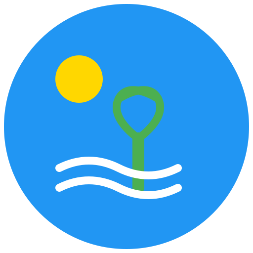

# 🌴 VacationVibe



> מערכת מתקדמת לניהול והצגת חופשות, המאפשרת למשתמשים לעקוב אחר יעדי נופש מועדפים ולמנהלים לנהל את מאגר החופשות.

## 📋 תוכן עניינים
- [סקירה כללית](#סקירה-כללית)
- [תכונות עיקריות](#תכונות-עיקריות)
- [טכנולוגיות](#טכנולוגיות)
- [התקנה והרצה](#התקנה-והרצה)
- [מבנה הפרויקט](#מבנה-הפרויקט)
- [הערות חשובות](#הערות-חשובות)
- [אודות המפתח](#אודות-המפתח)

## 🎯 סקירה כללית

VacationVibe היא פלטפורמה חדשנית המאפשרת:
- **למשתמשים**: גילוי, מעקב והזמנת חופשות
- **למנהלים**: ניהול מלא של מאגר החופשות וצפייה בסטטיסטיקות
- **לכולם**: חווית משתמש מודרנית ונוחה

## ✨ תכונות עיקריות

### 👥 משתמשים רגילים
- **צפייה בחופשות**: תצוגה מרהיבה של חופשות עם תמונות ופרטים
- **מעקב**: אפשרות לעקוב אחר חופשות מעניינות
- **סינון וחיפוש**: מציאה קלה של חופשות לפי תאריכים, יעדים ומחירים
- **התראות**: קבלת עדכונים על שינויים בחופשות במעקב

### 👑 מנהלי מערכת
- **ניהול חופשות**: הוספה, עריכה ומחיקה של חופשות
- **ניהול תמונות**: העלאה וניהול תמונות לכל חופשה
- **סטטיסטיקות**: צפייה בגרפים והתפלגויות של מעקב משתמשים
- **ייצוא נתונים**: אפשרות לייצוא נתונים לפורמטים שונים

### 🛡️ אבטחה
- **הרשאות**: מערכת הרשאות מתקדמת
- **אימות**: JWT מאובטח
- **הצפנה**: הצפנת סיסמאות וקישורים רגישים

## 🛠️ טכנולוגיות

### Frontend
- **React** + **TypeScript**
- **Material-UI** עם תמיכה ב-RTL
- **Redux Toolkit** לניהול מצב
- **Formik** + **Yup** לטפסים וולידציה
- **Chart.js** לגרפים וויזואליזציה

### Backend
- **Node.js** + **Express**
- **TypeORM** עם **MySQL**
- **JWT** לאימות
- **Multer** לניהול קבצים

### DevOps
- **Docker** + **Docker Compose**
- **Nginx** כ-reverse proxy
- **Redis** לקאש
- **GitHub Actions** ל-CI/CD

## 🚀 התקנה והרצה

### דרישות מקדימות
- Docker Desktop מותקן ופעיל
- Node.js גרסה 18 ומעלה
- פורטים פנויים: 80, 3001, 3306, 6379

### שלבי ההתקנה

1. **שכפול הפרויקט**
   ```bash
   git clone https://github.com/username/vacation-vibe.git
   cd vacation-vibe
   ```

2. **הגדרת משתני סביבה**
   ```bash
   # בתיקיית deployment/.env
   DB_USERNAME=vacation_user
   DB_PASSWORD=vacation123
   DB_DATABASE=vacation_db
   DB_ROOT_PASSWORD=root123
   JWT_SECRET=your_secret_key
   ```

3. **הרצת המערכת**
   ```bash
   cd deployment/scripts
   ./docker-build.bat  # או docker-compose build
   ./docker-start.bat  # או docker-compose up -d
   ```

4. **גישה למערכת**
   - ממשק משתמש: http://localhost
   - שרת: http://localhost:3001

### משתמשים לדוגמה
- **מנהל**:
  - אימייל: admin@test.com
  - סיסמה: 123456
- **משתמש רגיל**:
  - אימייל: user@test.com
  - סיסמה: 123456

## 📁 מבנה הפרויקט

```
vacation-vibe/
├── client/                 # React Frontend
│   ├── public/            # קבצים סטטיים
│   └── src/               # קוד מקור
│       ├── components/    # רכיבי React
│       ├── services/      # שירותים ו-API
│       ├── store/         # Redux store
│       └── types/         # TypeScript types
│
├── server/                # Node.js Backend
│   └── src/
│       ├── controllers/   # בקרי API
│       ├── entities/      # מודלי נתונים
│       ├── middleware/    # Middleware
│       └── services/      # לוגיקה עסקית
│
├── deployment/            # קבצי פריסה
│   ├── docker/           # הגדרות Docker
│   └── scripts/          # סקריפטים
│
└── docs/                 # תיעוד
    ├── api.md           # תיעוד API
    └── guides/          # מדריכים
```

## ⚠️ הערות חשובות

### אבטחה
- יש להגדיר JWT_SECRET חזק בסביבת הייצור
- מומלץ להפעיל HTTPS בפריסה
- יש לעדכן סיסמאות ברירת מחדל

### ביצועים
- Redis משמש לקאש ומשפר ביצועים
- תמונות עוברות אופטימיזציה אוטומטית
- המערכת מוגדרת ל-auto-scaling

### תחזוקה
- גיבויים אוטומטיים מוגדרים
- לוגים מרכזיים דרך Winston
- ניטור שגיאות ותקלות

## 👨‍💻 אודות המפתח

### אלעד יעקובוביץ'
- **התמחות**: מפתח Full-Stack
- **הכשרה**: בוגר מכללת ג'ון ברייס
- **גיל**: 38

### פרטי התקשרות
- **אימייל**: [eladhiteclearning@gmail.com](mailto:eladhiteclearning@gmail.com)
- **לינקדאין**: [eladyaakobovitchcodingdeveloper](https://www.linkedin.com/in/eladyaakobovitchcodingdeveloper/)
- **גיטהאב**: [eladjak](https://github.com/eladjak)
- **טלפון**: 052-542-7474

## 📄 רישיון
כל הזכויות שמורות © 2024 אלעד יעקובוביץ'