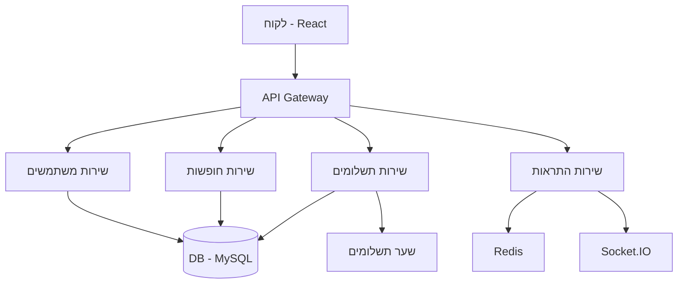
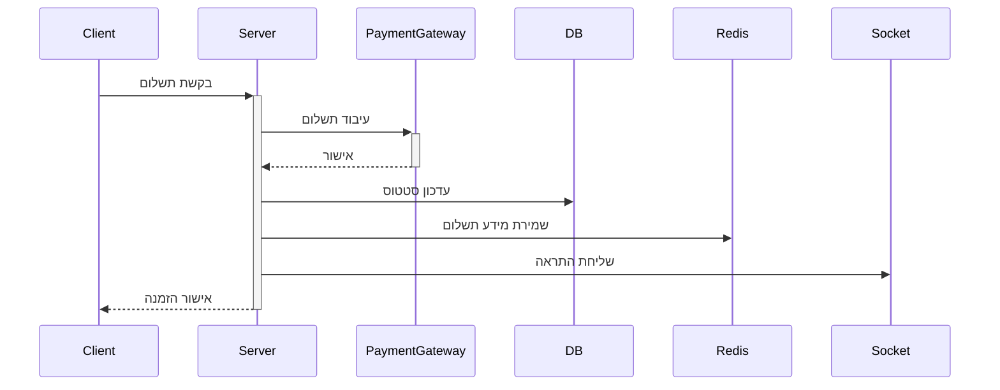

# 🏗️ ארכיטקטורת המערכת - VacationVibe

## 📋 סקירה כללית

### תרשים מערכת

## 🔄 זרימת מידע

### תהליך הזמנה
1. משתמש בוחר חופשה
2. מערכת בודקת זמינות
3. יצירת הזמנה זמנית
4. ביצוע תשלום
5. אישור הזמנה
6. שליחת התראות

### תהליך תשלום

## 🏛️ שכבות המערכת

### שכבת לקוח (Frontend)
- React 18
- Redux Toolkit Query
- Material UI v5
- TypeScript
- Socket.IO Client
- PWA Support

### שכבת שרת (Backend)
- NestJS
- TypeORM
- JWT Auth
- Redis Cache
- Bull Queue
- Socket.IO

### שכבת נתונים
- MySQL
- Redis
- S3 Storage
- ElasticSearch

## 🔌 תלויות מערכת
- Node.js 18+
- Docker
- Redis
- MySQL 8+
- S3 Compatible Storage
- ElasticSearch 8+

## 🛡️ אבטחה
- JWT Authentication
- Role Based Access
- SSL/TLS
- Rate Limiting
- XSS Protection
- CSRF Protection
- SQL Injection Prevention
- File Upload Security