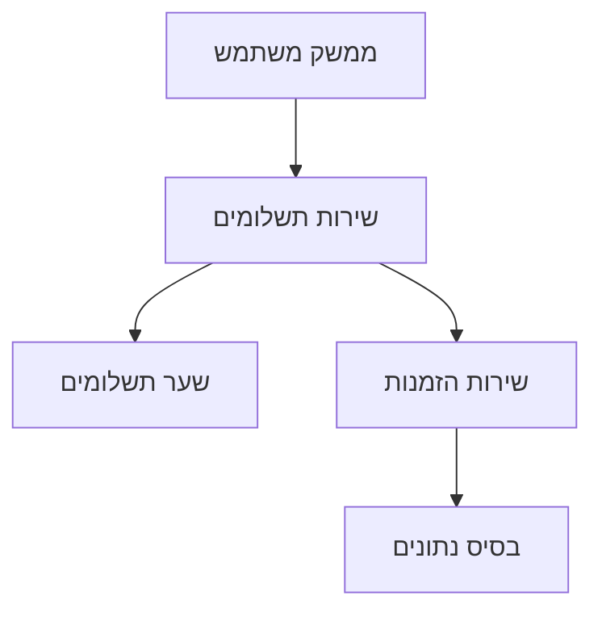

# 💳 תיעוד אינטגרציית תשלומים

## 🔧 ארכיטקטורה

## 📋 תהליך התשלום
1. יצירת הזמנה
2. חישוב סכום
3. שליחה לשער תשלומים
4. קבלת אישור
5. עדכון סטטוס

## 🔒 אבטחה
- הצפנת פרטי כרטיס
- תיקוף נתונים
- ניטור עסקאות
- טיפול בשגיאות

## 📊 ניטור וניתוח
- לוגים מפורטים
- מעקב עסקאות
- התראות בזמן אמת
- דוחות ביצועים 