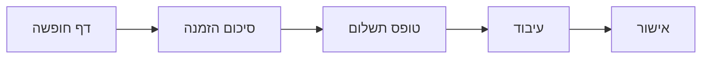

# 🎨 עיצוב תהליך תשלום - VacationVibe

## 📱 מסכי תשלום

### 1. סיכום הזמנה
- הצגת פרטי החופשה
- סיכום מחירים
- כפתור "המשך לתשלום"

### 2. טופס תשלום
- שדות כרטיס אשראי
- תיקוף בזמן אמת
- הצגת שגיאות ברורה

### 3. אישור תשלום
- אנימציית טעינה
- הודעת הצלחה/כישלון
- פרטי העסקה

## 🎯 עקרונות עיצוב
- פשטות ובהירות
- משוב מיידי למשתמש
- הנחיה ברורה
- נגישות מלאה

## 🔄 זרימת משתמש
